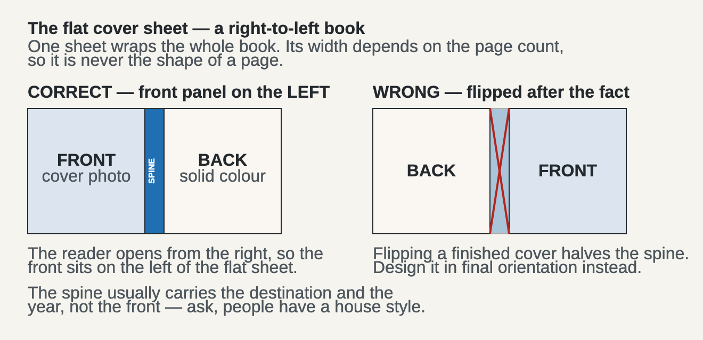

# printbook

Getting a finished book design out of your machine, into a print service's web editor, and ready for the customer
to order.

This is the least glamorous part of making a printed object and the one most likely to waste an afternoon. The
editor is a web application built for a person dragging photos around: slow, stateful, and easy to get subtly
wrong in ways nothing warns you about. A page can end up holding a right-looking image from the wrong file.

## Objects or images — the decision that shapes everything

**Route A** rebuilds each page inside the editor from its own objects: photo frames, text boxes, stickers. The
customer can edit text there afterwards. But you are re-implementing a layout you already have, in a tool with no
undo you can trust, across a browser connection — the editor's fonts are not your fonts, spacing will not match,
and every page is dozens of interactions.

**Route B** renders each page to one finished image and drops it into the editor's full-page template. Crops,
type, graphics and texture are baked in. The service cannot mangle the layout and does not need your fonts. One
upload and one placement per page.

**Take Route B unless the customer specifically needs to edit text in the editor later** — and say that trade-off
out loud before you start, because undoing it means re-rendering everything.

Route B also makes verification possible. A page either holds the right picture or it does not, and you can prove
which.

## The shape of the work

```
render pages at the printer's exact pixel size   →  contact sheet, looked at by a person
upload the set                                   →  place spread by spread
frame to full page at 0,0, no zoom, no nudge     →  save, and read the confirmation
walk every spread                                →  3D preview  →  hand back
```

Never the last step. **Placing the order is the customer's own action**, always — and card details are not
something to touch at all.

## Right-to-left books

The one that is easiest to get backwards, and expensive when you do:



Page 1 is a **left** page, so place spreads right-hand page first. And design the cover in its final orientation:
flipping a finished left-to-right cover cuts the spine text in half.

## The traps that cost real time

**The upload tray reshuffles when you replace an image.** The worst one, because it is silent. Replacing a page
returns the old image to the "not used" list, which re-orders the tray, so the next drag picks up a neighbour. In
one run page 9 received page 19's content this way and nothing flagged it. **Match by what the thumbnail shows,
never by its position**, and re-check the page you just changed *and* the one after it.

**The browser connection will drop mid-run.** It dropped twice in one session, and both times the action had
already gone through. **Read the current state before redoing anything** — a blind retry is how a page gets
placed twice.

**Single pages behave differently from spreads.** The first and last page have no facing page and their tray slot
can hold something unexpected; one book's last page quietly received an old cover draft.

**Old drafts stay in the tray.** Superseded uploads remain in the list. They print nothing, but they are sitting
there waiting to be grabbed by mistake.

**Trust the quality indicator.** Your files are exactly 300 DPI at printed size, so if the editor reports a low
resolution for a page, something scaled it — that is a real defect, not a fussy warning.

**Get the trim size from the service, now.** Not from memory, not from the last project. Sizes change: one album
series changed dimensions after an equipment upgrade between two orders.

## Contents

```
SKILL.md                 the method, for Claude Code
references/preflight.md  what to check on the rendered files before opening a browser
references/services.md   what differs between print services, and what to establish first
examples/                the cover-sheet diagram above
```

## Related

`../tripmap` draws maps for the pages. A future `printcheck` skill would automate most of `references/preflight.md`
— resolution per placed image, fonts actually used versus requested, ink coverage, bleed and trim safety — which
is the class of defect that passes every check and ruins the printed object.
