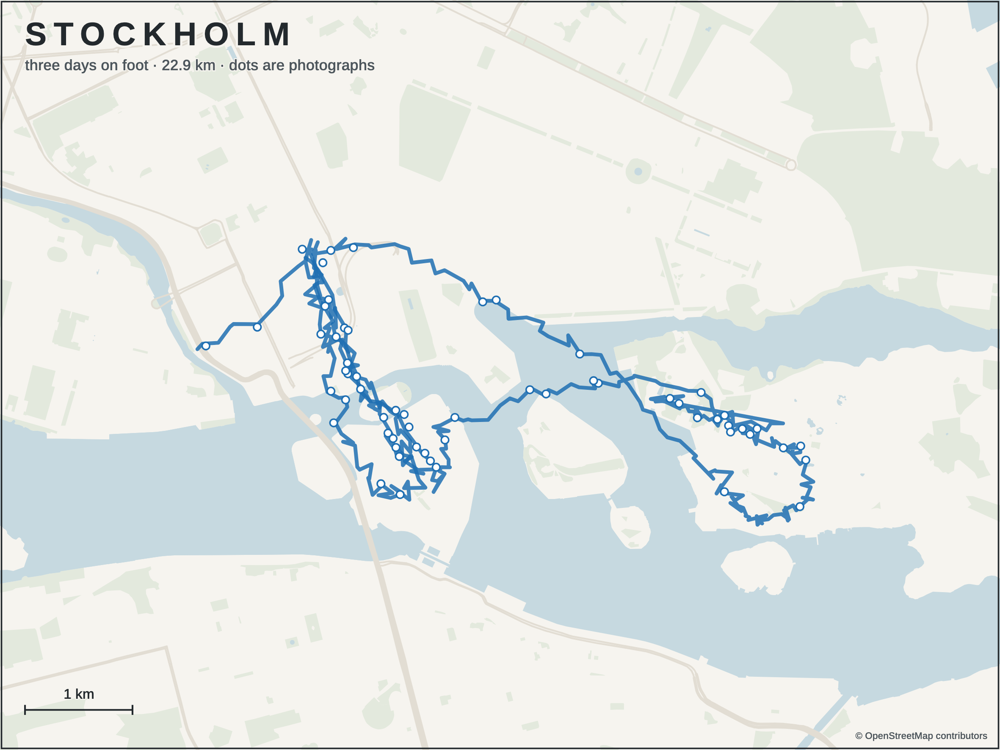
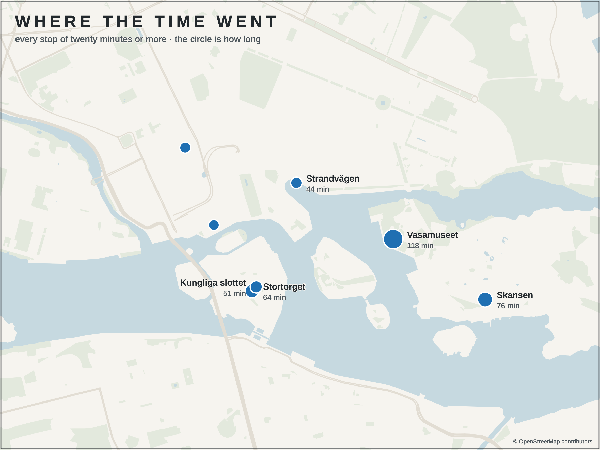
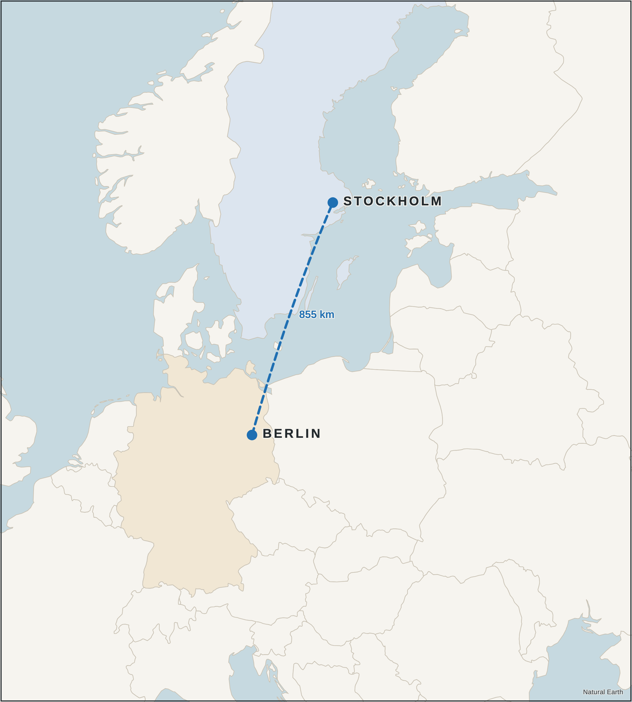

# tripmap

Print-quality maps of a journey, drawn from data the traveller already has.

Not a screenshot of a map service — a drawing with one argument, *this is where we went*, where everything else on
the page exists to make that line legible. Output is SVG in millimetres plus a 300 DPI PNG, so a 0.34 mm line is
0.34 mm on paper.

Three inputs, and a fourth that is easy to overlook:

| input | what you get |
|---|---|
| **Location-history export** | every movement by day, walking-only paths, stops of N minutes |
| **Photo EXIF GPS** | the places somebody stood long enough to take a picture |
| **Source → destination** | a real great-circle arc and its distance |
| **Named stops** | *where the time went* — as opposed to the transport in between |

```bash
python3 scripts/points.py timeline export.json --tz Europe/Stockholm
python3 scripts/points.py exif ~/Pictures/trip
python3 scripts/points.py route "Berlin" "Stockholm"
```

Read `SKILL.md` for the method, `references/recipes.md` for the five archetypes, and `references/data-sources.md`
for schemas, Overpass etiquette and what each licence requires you to print.

## Run it, on data belonging to nobody

Location history is among the most sensitive files a person owns, so everything shown here is a **fictional** four
days in Stockholm for a traveller who does not exist. `mockdata.py` writes an export with the same shape as a real
one — movement paths, activity segments with modes and distances, stops with coordinates and no names — following
real streets and ferry lanes, interpolated to about a point a minute and jittered the way a phone jitters. It is
seeded, so every run produces the same trip.

```bash
python3 scripts/mockdata.py                                   # 28 segments, 91 photos, 27.2 km on foot
./scripts/fetch_osm.sh stockholm 59.310 18.020 59.350 18.130  # real geography, one Overpass call
mv scripts/osm_stockholm.json example-data/
python3 scripts/demo_maps.py                                  # the maps below
```



**A city walk.** The line is the export filtered to walking segments and broken wherever the GPS jumps; the white
dots are photographs. The land is built from coastline ways, because **OpenStreetMap has no sea** — draw a harbour
city without handling that and you get solid land with no islands at all.

 

**Left — the same days as stops**, every halt of twenty minutes or more, the circle sized by how long. A stop is
where the story is; the line between stops is just transport. **Right — a great circle**, which is what a flight
actually is. The arc and the distance come from the same call, so the number cannot disagree with the line.

## The five archetypes

Every trip map is one of these. Copy the nearest recipe in `references/recipes.md` and change the numbers.

**1 · Flight** — source to destination. A great circle, because over any distance worth drawing the true path bends
toward the pole and a straight line looks wrong. Dashed, because a solid line reads as a road. Country outlines
from Natural Earth: OpenStreetMap at that zoom is enormous and looks wrong. Tint only the two countries that
matter and the map answers *from where to where* before anybody reads a word.

**2 · Region** — a week rather than a day: airport, city, the places stayed. At this scale ask Overpass for less —
coastline, motorway, trunk, water. A region-sized box with every secondary road times out or comes back rate-limited.

**3 · City walk** — the one that carries the most meaning, because it is literally the route somebody walked. Two
layers with two meanings: the line is where they went, the dots are where they stopped to look, and the dots come
free from the photographs.

**4 · Island and coast** — anywhere the water is most of the picture. `coast.py` clips coastline ways to the box,
polygonises them with the box edge, and calls a face *land* when a probe point just to its left falls inside;
OpenStreetMap coastline ways keep land on their left by convention. Islands and the holes between them come out of
the same step. Forty-seven lines, and the hardest part of the toolkit.

**5 · Route** — a drive. Use the recorded track, not a routing engine: an API gives the road somebody *should*
have taken, the export gives the one they did, including the wrong turn and the stop for fuel.

## Things that cost real time to learn

- **Never sum distance straight down a point list.** Mixing two days, a photo with a bad fix, or a vehicle leg
  between two walks all produce one enormous jump. A week of city walking summed straight reads **3,381 km**; split
  at the jumps first it reads **45.7 km across 23 separate walks**. Obviously wrong on a page, quietly wrong in a
  caption — use `track_km()`.
- **A raw movement path is jitter.** Filtering to walking segments is what turns a scribble into a map of a walk,
  and the line still has to break where the GPS jumps or a ferry draws as though somebody swam.
- **A missing font does not fail, it substitutes a serif.** At 9 pt the hairline serifs are sub-pixel at 300 DPI,
  which reads as a blurry map rather than a wrong typeface. `render.sh` refuses to render a drawing that names a
  family with no file on disk.
- **A text halo must be proportional to the type** (~0.14 em). A fixed 1.2 mm halo closes the counters of O, G, R
  and e, and the labels turn to mush.
- **Right-to-left text flips the anchor once.** Flip it again in your own code and every label sits on its own dot.
- **Labels collide.** Two stops 150 m apart stack. `demo_maps.py` tries right, left, above and below and takes the
  first placement that does not overlap. Five labels is a five-minute problem; general label placement is a
  research field and not worth solving here.
- **`fit` or `fill`, and know which you asked for.** A flight map drawn to fill loses an endpoint off the edge, and
  nobody notices until it prints.

## Privacy

An export covers the days either side of a trip, and photo GPS covers wherever the camera was — which means both
contain the traveller's home. `geocode.py` measures everything against the trip's own centre, the median of the
photographs' GPS, and never looks up anything more than 300 km away, so a home address is never sent to a
third-party geocoder.

Work on a copy filtered to the trip window, keep it out of version control, and do not upload it. `.gitignore` in
this repository refuses exports, photo indexes and geocoder caches by name.

## Layout

```
SKILL.md            the method, for Claude Code
scripts/            points · geocode · mapkit · coast · fetch_osm · render · mockdata · demo_maps
references/         recipes.md (the five archetypes) · data-sources.md (schemas, etiquette, licences)
example-data/       the generated trip: timeline.json · photos.csv · itinerary.json
examples/           maps drawn from it
fonts/              Arimo (Apache 2.0) and Heebo (OFL), so the renderer never falls back
```

Not committed, because each is one command away and large: the Overpass dump, Natural Earth's country outlines
(2.9 MB, public domain), and the rendered SVGs, which embed the whole basemap.

## Requirements

`python3` with `shapely` (coastlines) and `Pillow`; `exiftool` for photo GPS; Google Chrome for rendering.
Everything else is standard library.

## Credits

Map data © OpenStreetMap contributors (ODbL) · country outlines from Natural Earth (public domain) · reverse
geocoding by Nominatim. Each requires or asks for its credit **on the map**, which is one 2 mm line and also makes
the drawing look like it came from somewhere real.
